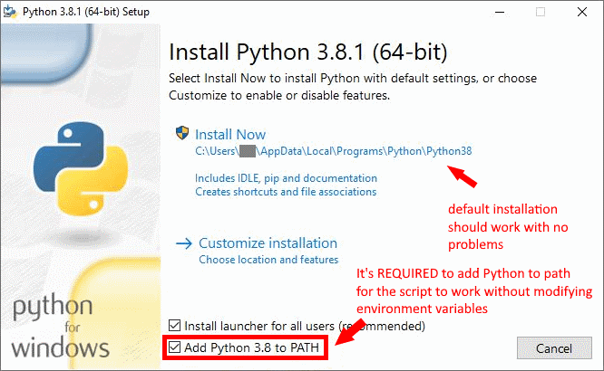
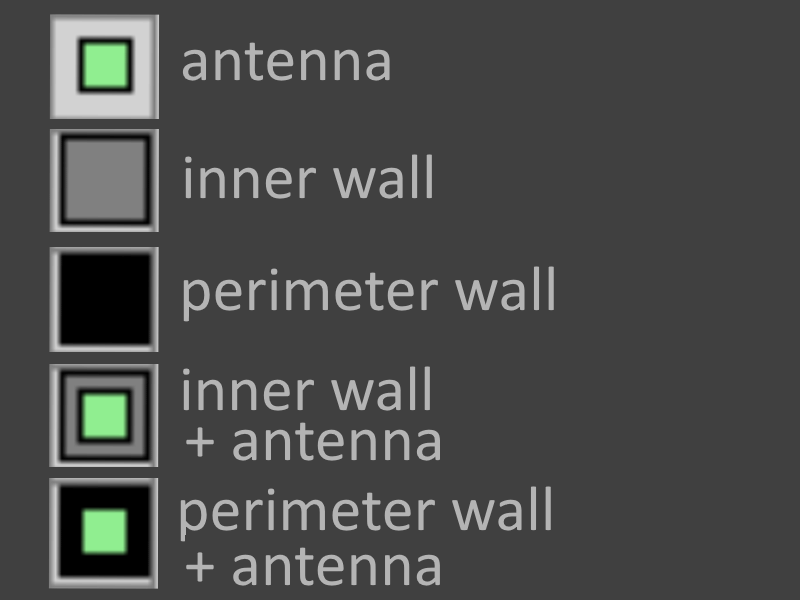

# RSSI Simulator

## How to run

Developed under Python 3.8: [Download](https://www.python.org/downloads/)

### Windows

**Python must be on system PATH for the script to work automatically**

From the installer:



After installation:

Double click on ```start.bat```

This will launch pip to install all required libraries (requirements.txt).

Once all dependencies are downloaded it will start the program on its own.

### Linux / OSX

launch ```bash start.sh``` from the terminal

## Settings

All settings are stored in ```settings.json```

**TRASMITTED_POWER**: Power transmitted by the beacon
DEFAULT -4 (dBm)

**COUPLING_FACTOR**, **WAVE_FACTOR**: Respectively the values in dB in free path loss calculations given by the antenna coupling and the signal frequency
DEFAULT: 1, 40

**PATH_LOSS_PERIM**: Wall path loss in dB from perimetral walls (thicker)
DEFAULT: -14 (dB)

**PATH_LOSS_INTERNAL**: Wall path loss in dB from internal walls (thinner)
DEFAULT: -3 (dB)

**NOISE**: Noise values contraints for every antenna measurement. The noise is calculated with an exponential distribution between given NOISE setting values
DEFAULT: [-30, 0] (dB)

**THRESHOLD**: Power value that marks when an antenna signal is too far to be worth collecting
DEFAULT: -95 (dB)

**PACKET_LOSS**: Probability to lose an antenna measurement at a given time.
DEFAULT: 0.1 (10%)

**DELAY**: Delay between simulations
DEFAULT: 0.3 (seconds)

**SIM_WINDOW**: Number of simulations required to estimate the median coordinates.
DEFAULT: 5

## Colors

### Blocks



### Circles

#### Blue

Blue circles represent antennas which signal is actually received at a given time

#### Yellow

The yellow circle represents the estimated point using all data from the antennas

#### Light blue

The light blue circle represents the estimated location using median on the last SIM_WINDOW simulations (last SIM_WINDOW yellow circles)

#### Orange

An orange circle is shown on the antenna that gives the strongest signal at a given instance of the simulation
